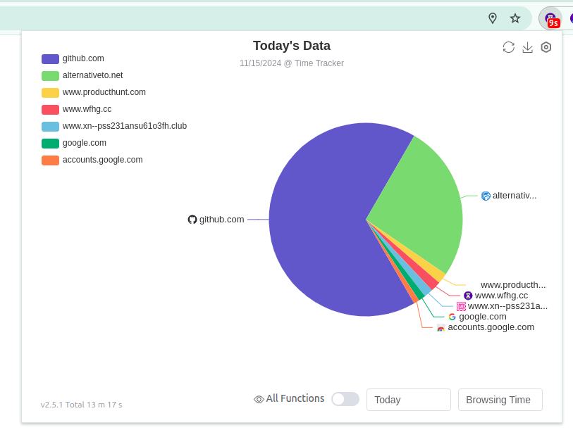
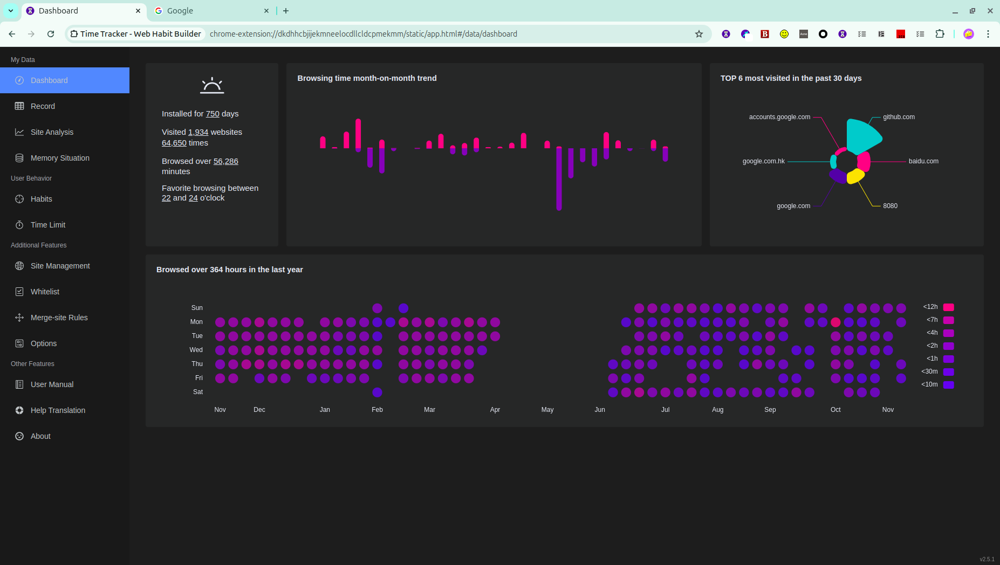
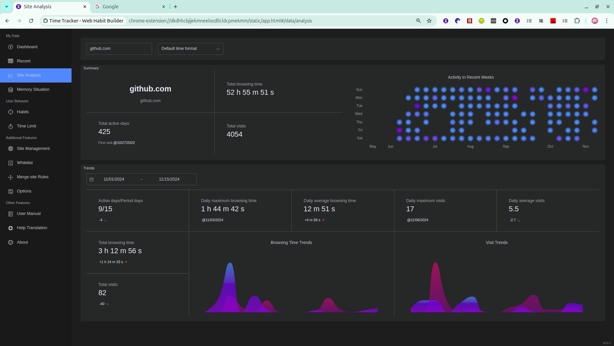
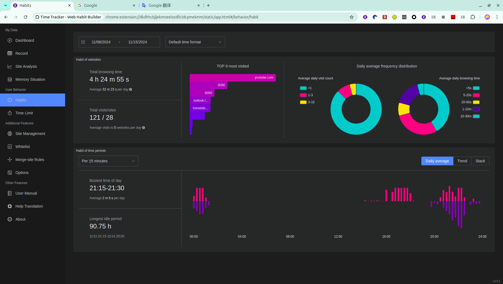

# Time Tracker - Web Habit Builder

  
  
  

\[ English | [简体中文](./README-zh.md) \]

Time Tracker - Web Habit Builder is a browser extension that tracks the time you spend on websites and helps you understand your browsing habits.

It includes detailed browsing records, dashboards and analytical reports, website management, limits and page blocking, Focus and Pomodoro sessions, and tools for synchronizing, backing up, and migrating data.

It is built with Rspack, TypeScript, Vue 3, Element Plus, and ECharts. You can install it for Firefox, Chrome, and Microsoft Edge.

## Features

-   Track browsing time and visit counts
-   Review detailed records and daily activity
-   View dashboards, website analysis, and habit reports
-   Manage websites and configure whitelist and merge rules
-   Set daily, weekly, and per-visit website limits
-   Block pages when configured limits are reached
-   Create and run Focus and Pomodoro sessions
-   Export and import settings
-   Synchronize data through the supported browser account
-   Back up data with GitHub Gist, WebDAV, or Obsidian Local REST API
-   Use data migration, storage information, and record-clearing tools
-   Customize appearance, tracking, accessibility, limits, backups, and notifications

See the [official guide](https://time-tracker-4-browser.app/en/guide/start) for detailed instructions.

## Download

| Released                                                                                                                            | Version                                                                                                                                                                                                     | Rating                                                                                                                                                                                                             | User Count                                                                                                                                                                                                   |
| ----------------------------------------------------------------------------------------------------------------------------------- | ----------------------------------------------------------------------------------------------------------------------------------------------------------------------------------------------------------- | ------------------------------------------------------------------------------------------------------------------------------------------------------------------------------------------------------------------ | ------------------------------------------------------------------------------------------------------------------------------------------------------------------------------------------------------------ |
| [Chrome Web Store](https://chromewebstore.google.com/detail/time-tracker-for-browser/dkdhhcbjijekmneelocdllcldcpmekmm?hl=en)        |                                                                                                    |                                                                                                      |                                                                                                              |
| [Microsoft Edge Addons](https://microsoftedge.microsoft.com/addons/detail/time-tracker-web-habit-/fepjgblalcnepokjblgbgmapmlkgfahc) |  |  |  |
| [Firefox Browser Addons](https://addons.mozilla.org/en-US/firefox/addon/besttimetracker/)                                           |                                                                                                                                           |                                                                                                                                                          |                                                                                                                                       |

[How to install manually for Safari](./doc/safari-install.md)

## Screenshots

    
    
Daily percentage

    
    
Dashboard

    
    
Analytical Report

    
    
Habit Report

    
    
Page Blocking

## Feedback

If you encounter any issues or have suggestions during use, feel free to reach out through the following channels:

#### 1. Submit an Issue

Describe your problem or feature request in [GitHub Issues](https://github.com/sheepzh/time-tracker-4-browser/issues), and we'll get back to you as soon as possible.

#### 2. Join Discord

Join our [Discord community](https://discord.gg/yXCngD8pKS) to chat directly with the developer and other users.

#### 3. Create a Discussion

Start a topic in [GitHub Discussions](https://github.com/sheepzh/time-tracker-4-browser/discussions) to share experiences, ask questions, or discuss open-ended ideas.

## Contribution

There are several ways you can contribute to this software.

#### 1. Participate in development

If you know how to develop browser extensions and are familiar with the project's technology stack—TypeScript, Vue 3, Element Plus, and ECharts—you can contribute code, tests, or documentation.

See the [Development Guide](./CONTRIBUTING.md).

#### 2. Improve translations

Most of the software's localization relies on machine translation. You can submit translation suggestions on [Crowdin](https://crowdin.com/project/timer-chrome-edge-firefox).

#### 3. Rate the extension

You can support the project by leaving a review:

[Firefox](https://addons.mozilla.org/firefox/addon/besttimetracker) /
[Chrome](https://chromewebstore.google.com/detail/time-tracker/dkdhhcbjijekmneelocdllcldcpmekmm/reviews) /
[Edge](https://microsoftedge.microsoft.com/addons/detail/timer-the-web-time-is-e/fepjgblalcnepokjblgbgmapmlkgfahc)

It is simple and helpful. Your feedback supports the project.

For information about data handling, see the [Privacy Policy](https://time-tracker-4-browser.app/en/privacy.html).

## ❤️ Thanks To

